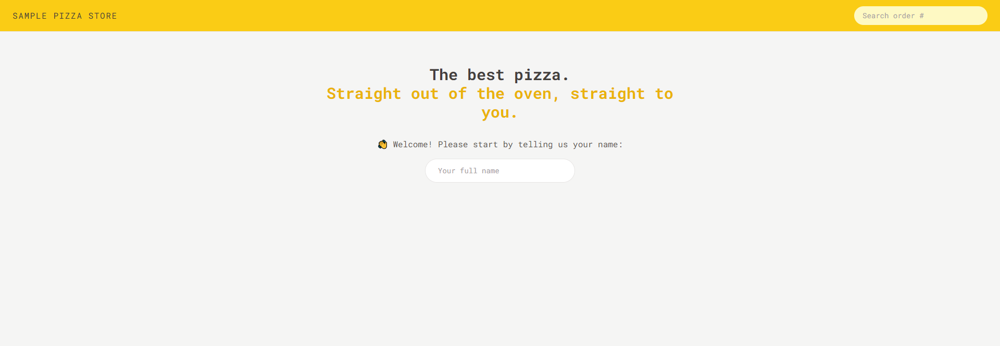
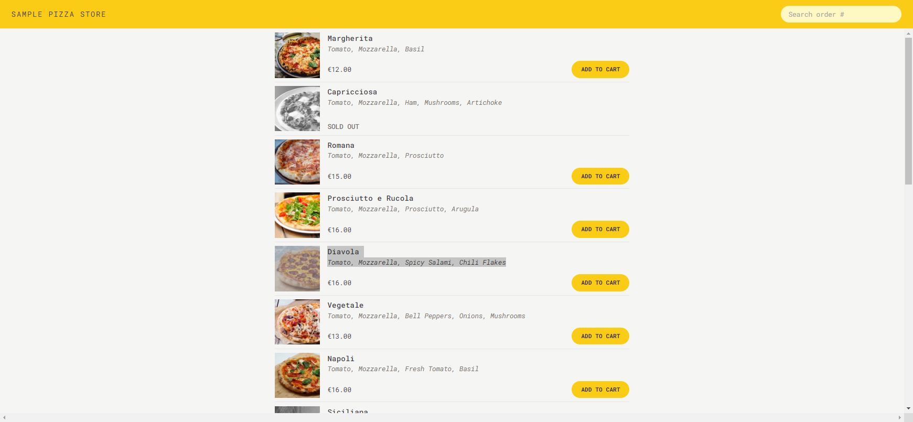
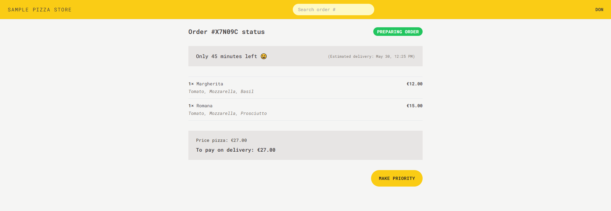

<div align="center">

<h2>🍕 Sample Pizza Shop</h2>

</div>

<div align="center">

<a href="https://sample-pizza-shop.netlify.app/">View Demo</a>
•
<a href="https://github.com/DonRadonZ/Sample-Pizza-Store/issues">Report Bug</a>
•
<a href="https://github.com/DonRadonZ/Sample-Pizza-Store/pulls">Request new feature</a>

</div>


<div align="center">

<a href="https://www.facebook.com/supachai.sinkraseam/"></a>
<a href="https://www.linkedin.com/in/supachai-s-40650a104/"></a>
</div>


Website sample for Who want to buy pizza you can buy at here. This project use Tailwind, Redux and React Router as part of project


## Screenshot







## Key Features

* Simple application, where user can buy one or more pizza from menu.
* Require user no **login/sign up** before going to buy pizza
* User can add multiple pizza to the cart before ordering.
* Order require **user's name**, **phone number** and **address**
* **GPS location** is provide, to help delivery easier.
* User's can **mark their order as "priority"** for an additional 20% of the cart price
* Order will send POST request with the api
* Payment made on delivery **no payment** necessary in app.
* Each order get **unique ID** that should be display 
* user should mark their order "priority" or even placed  


### Library

* React
* Typescript
* React-Router-Dom
* Redux
* TailwindCss


### What I learned

* **React Fundamental** This part I gained knowledge and understanding about manage component and how to route.
* **Feature and Page** This part I learned about how to set priority order between route and page.
* **TailwindCSS instead of CSS** I gained knowledge about how to design application using TailwindCSS by learn fundamental and understanding document
* **Redux** I gained knowledge about how to use react with Redux with createThunk for fetch address data.
* **Project Planning** I gained knowledge about project planning from course and managing project.

By building sample pizza shop I've use my skill and knowledge from this technology to do this project from this course and use for apply to another project.

## Installation

* Clone this repository:

```
git clone https://github.com/DonRadonZ/Sample-Pizza-Store.git
```

* Change Directory to Cilent:

```
cd Cilent
```

* Install dependencies:

```
npm install or yarn install
```

* Build command:

```
npm run build or yarn run build
```

* Live server:

```
npm run dev or yarn run dev
```

## Contributing
I welcome contribution for pull request.

## Authors and acknowledgment

 **Supachai Sinkaseam**

* LinkedIn - [@supachai-s-40650a104](https://www.linkedin.com/in/supachai-s-40650a104/)
* Facebook - [@supachai.sinkraseam](https://www.facebook.com/supachai.sinkraseam)
* Github - [@DonRadonZ](https://github.com/DonRadonZ)

Feel free to contact me with any question or feedback


## Acknowledgements

This app was developed as a part of [Udemy course](https://www.udemy.com/course/the-ultimate-react-course/?couponCode=24T3MT53024) "The Ultimate React Course 2024: The Ultimate React Course 2024: React, Next.js, Redux & More" by [Jonas Schmedtmann](https://www.udemy.com/user/jonasschmedtmann/). Special think jonas about teaching and guidance from this course.
